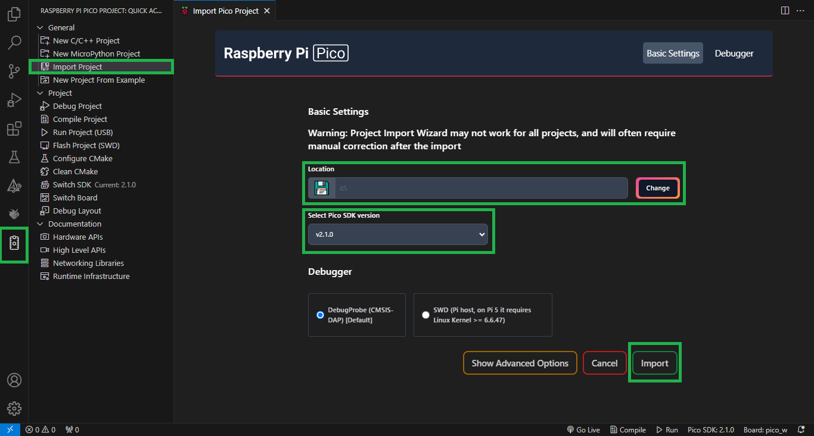

# Clock e Temporizadores  

## Descrição do Projeto  

Este projeto visa explorar o uso de temporizadores no microcontrolador RP2040, utilizando a placa de desenvolvimento BitDogLab. O objetivo principal é desenvolver um semáforo com temporização periódica e um sistema de temporização de um disparo para o acionamento de LEDs a partir de um botão.  

## Pré-requisitos  

Antes de executar o projeto, certifique-se de ter os seguintes softwares e ferramentas instalados:  

- [Visual Studio Code (VS Code)](https://code.visualstudio.com/download)  
- [Extensão Raspberry Pi Pico para VS Code](https://marketplace.visualstudio.com/items?itemName=raspberry-pi.raspberry-pi-pico)  
- [Extensão Wokwi Simulator para VS Code](https://marketplace.visualstudio.com/items?itemName=Wokwi.wokwi-vscode)  
- [Git](https://git-scm.com/downloads)  
- [SDK para Raspberry Pi Pico (Pico SDK)](#instalação-e-configuração-do-ambiente)  

Além disso, será necessário possuir uma conta no [site oficial do Wokwi](https://wokwi.com/).  

## Estrutura do Repositório  

```
├── img/                    # Imagens utilizadas no README para detalhar o projeto
├── one_shot_timer/         # Projeto do temporizador de um disparo (One Shot)
    ├── .vscode/                # Configurações específicas do projeto para o VS Code
    ├── .gitignore              # Arquivos ignorados pelo Git
    ├── CMakeLists.txt          # Configuração do CMake para o projeto
    ├── diagram.json            # Arquivo de configuração para o simulador Wokwi
    ├── one_shot_timer.c        # Código-fonte principal do projeto
    ├── pico_sdk_import.cmake   # Configuração para importar o Pico SDK
    └── wokwi.toml              # Arquivo de configuração do Wokwi
├── periodic_timer/         # Projeto do temporizador periódico
    ├── .vscode/                # Configurações específicas do projeto para o VS Code
    ├── .gitignore              # Arquivos ignorados pelo Git
    ├── CMakeLists.txt          # Configuração do CMake para o projeto
    ├── diagram.json            # Arquivo de configuração para o simulador Wokwi
    ├── periodic_timer.c        # Código-fonte principal do projeto
    ├── pico_sdk_import.cmake   # Configuração para importar o Pico SDK
    └── wokwi.toml              # Arquivo de configuração do Wokwi
└── README.md               # Instruções e detalhes dos projetos
```
`OBS.:` o subdiretório `build/` será adicionado ao diretório principal de cada projeto após a configuração automática do CMake.  

## Instalação e Configuração do Ambiente
1. Clone este repositório para seu ambiente local:  
   ```
   git clone https://github.com/SauloAntunes/Tarefa-Clock-Timers.git  
   ```

2. Com o VS Code aberto, configure o ambiente de desenvolvimento do Pico SDK, seguindo as instruções:  
    ### **IMPORTANTE**: ESTE REPOSITÓRIO CONTÉM 2 PROJETOS. ESCOLHA UM PROJETO, CONFIGURE E TESTE. DEPOIS, REPITA O PROCESSO PARA O OUTRO PROJETO.
    - O Pico SDK pode ser configurado de forma automática durante a configuração do projeto através da extensão Raspberry Pi Pico no VS Code.  
      
    - Passo a passo:  
    `1º:` acesse a extensão Raspberry Pi Pico;  
     `2º:` selecione a opção `Import Project`;  
    `3º:` adicione o caminho do projeto no seu dispositivo, selecione a versão 2.1.0 do Pico SDK (é importante selecionar essa versão para evitar possíveis incompatibilidades) , e por fim clique em `Import`.  
    `OBS.:` após isso, a própria ferramenta realizará a configuração do Pico SDK. Durante o processo de configuração, notificações serão exibidas no canto inferior direito da tela, indicando cada etapa.  

3. Compile o projeto:  
  
  - Passo a passo:  
    `1º:` com o projeto aberto no VS Code, acesse a extensão Raspberry Pi Pico;  
    `2º:` clique na opção `Compile Project` e aguarde o processo de compilação.   

4. Com o VS Code aberto, configure o ambiente Wokwi, seguindo as instruções:
    - A configuração do Wokwi para VS Code pode ser realizada seguindo as orientações disponíveis na [documentação oficial](https://docs-wokwi-com.translate.goog/vscode/getting-started?_x_tr_sl=en&_x_tr_tl=pt&_x_tr_hl=pt&_x_tr_pto=tc&_x_tr_hist=true).

5. Inicie a simulação do projeto:  
    - Para iniciar a simulação do projeto clique no arquivo `diagram.json`, logo em seguida será aberta uma tela com a simulação do projeto, contendo os componentes como a placa Raspberry Pi Pico W, os LEDs, entre outros. Após a abertura da simulação do projeto, clique no botão verde de começar.  

## Estrutura de Controle    

- Projeto **`periodic_timer/`**:  
    - Semáforo com temporização de 3 segundos para cada alteração de sinal. O acionamento dos LEDs (sinais do semáforo) inicia na cor vermelha, alterando para amarela e, em seguida, verde.
    - A rotina principal envia uma mensagem pela portal serial a cada 1 segundo.  

- Projeto **`one_shot_timer/`**: 
    - Ao pressionar o botão, os três LEDs serão acesos. Passados 3 segundos, o primeiro LED (azul) se apagará; após mais 3 segundos, o segundo LED (vermelho) se apagará; e finalmente, depois de outros 3 segundos, o terceiro LED (verde) se apagará.
    - O botão só pode mudar o estado dos LEDs após o último LED (verde) ser apagado. Portanto, durante as rotinas de temporização, o botão não iniciará uma nova execução da função de retorno (call-back).  